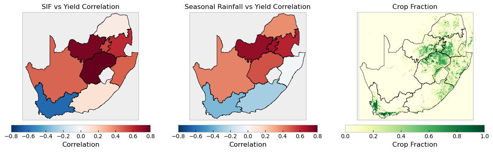
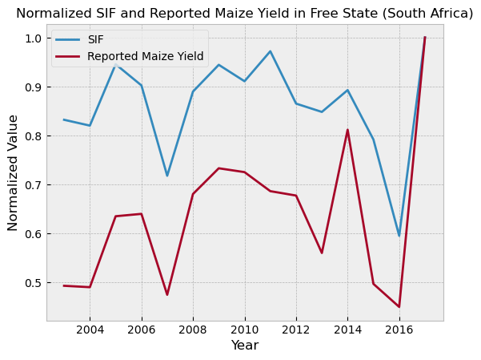
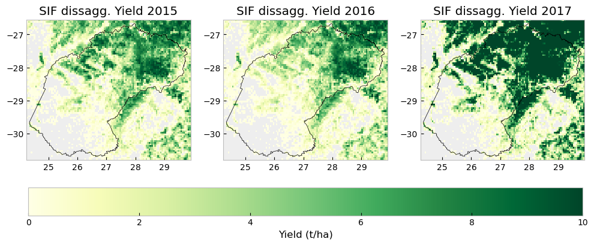
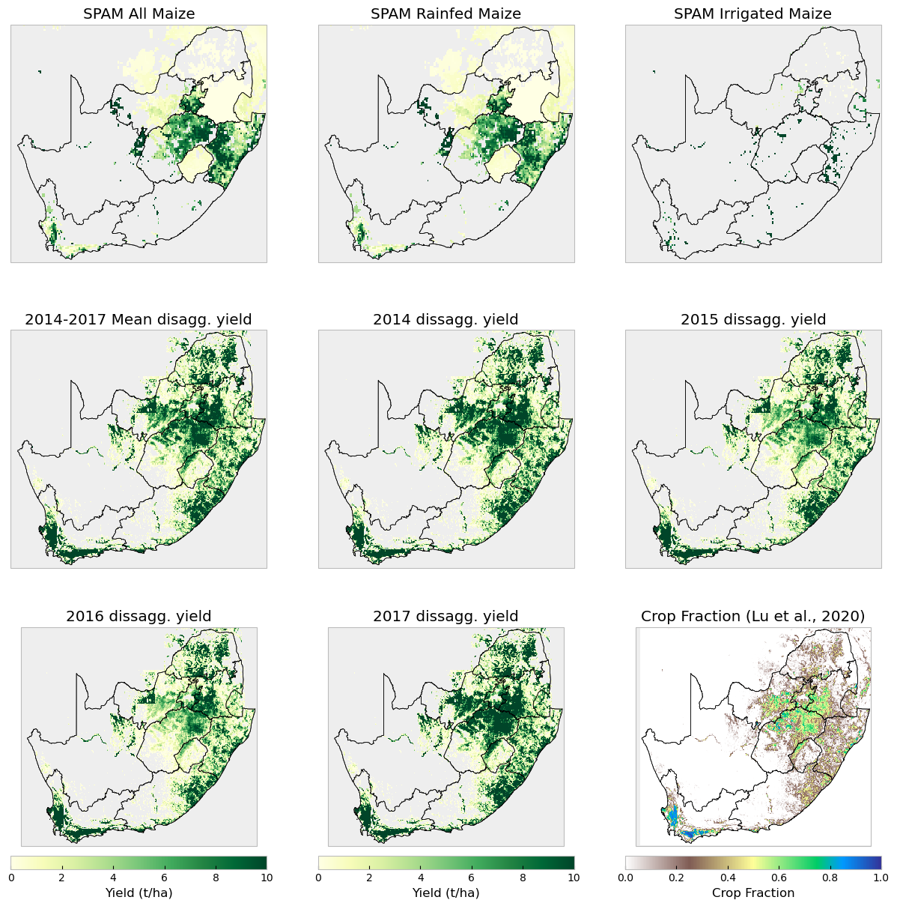

    Saving figure to /home/chc-source/shrad/Scripts/Funded_projects/2026/crop_yield_forecasting/results/figures//SIF_yield_correlation_map.png

    

    

    Saving figure to /home/chc-source/shrad/Scripts/Funded_projects/2026/crop_yield_forecasting/results/figures//SIF_vs_Yield_in_Free_State.png

    

    

    Saving figure to /home/chc-source/shrad/Scripts/Funded_projects/2026/crop_yield_forecasting/results/figures//comparison_of_downscaled_yield_maps_for_free_state.png

    

    

    Saving downscaled yield for Western Cape to /home/chc-shrad/DATA/Crop_yield_forecasting/Disaggregated_yield/SIF_based/downscaled_yield_fnid_ZA1994A101_South_Africa_Western_Cape.nc
    Saving downscaled yield for Eastern Cape to /home/chc-shrad/DATA/Crop_yield_forecasting/Disaggregated_yield/SIF_based/downscaled_yield_fnid_ZA1994A102_South_Africa_Eastern_Cape.nc
    Saving downscaled yield for Northern Cape to /home/chc-shrad/DATA/Crop_yield_forecasting/Disaggregated_yield/SIF_based/downscaled_yield_fnid_ZA1994A103_South_Africa_Northern_Cape.nc

    /home/shrad/miniforge3/envs/py312/lib/python3.12/site-packages/dask/array/reductions.py:654: RuntimeWarning: All-NaN slice encountered
      return np.nanmax(x_chunk, axis=axis, keepdims=keepdims)

    Saving downscaled yield for Free State to /home/chc-shrad/DATA/Crop_yield_forecasting/Disaggregated_yield/SIF_based/downscaled_yield_fnid_ZA1994A104_South_Africa_Free_State.nc
    Saving downscaled yield for Kwazulu-Natal to /home/chc-shrad/DATA/Crop_yield_forecasting/Disaggregated_yield/SIF_based/downscaled_yield_fnid_ZA1994A105_South_Africa_Kwazulu-Natal.nc
    Saving downscaled yield for North West to /home/chc-shrad/DATA/Crop_yield_forecasting/Disaggregated_yield/SIF_based/downscaled_yield_fnid_ZA1994A106_South_Africa_North_West.nc
    Saving downscaled yield for Gauteng to /home/chc-shrad/DATA/Crop_yield_forecasting/Disaggregated_yield/SIF_based/downscaled_yield_fnid_ZA1994A107_South_Africa_Gauteng.nc
    Saving downscaled yield for Mpumalanga to /home/chc-shrad/DATA/Crop_yield_forecasting/Disaggregated_yield/SIF_based/downscaled_yield_fnid_ZA1994A108_South_Africa_Mpumalanga.nc
    Saving downscaled yield for Limpopo to /home/chc-shrad/DATA/Crop_yield_forecasting/Disaggregated_yield/SIF_based/downscaled_yield_fnid_ZA1994A109_South_Africa_Limpopo.nc

    Saving figure to /home/chc-source/shrad/Scripts/Funded_projects/2026/crop_yield_forecasting/results/figures//SPAM_2020_vs_SIF_disaggregated_yield_comparison_for_South_Africa.png

    

    

