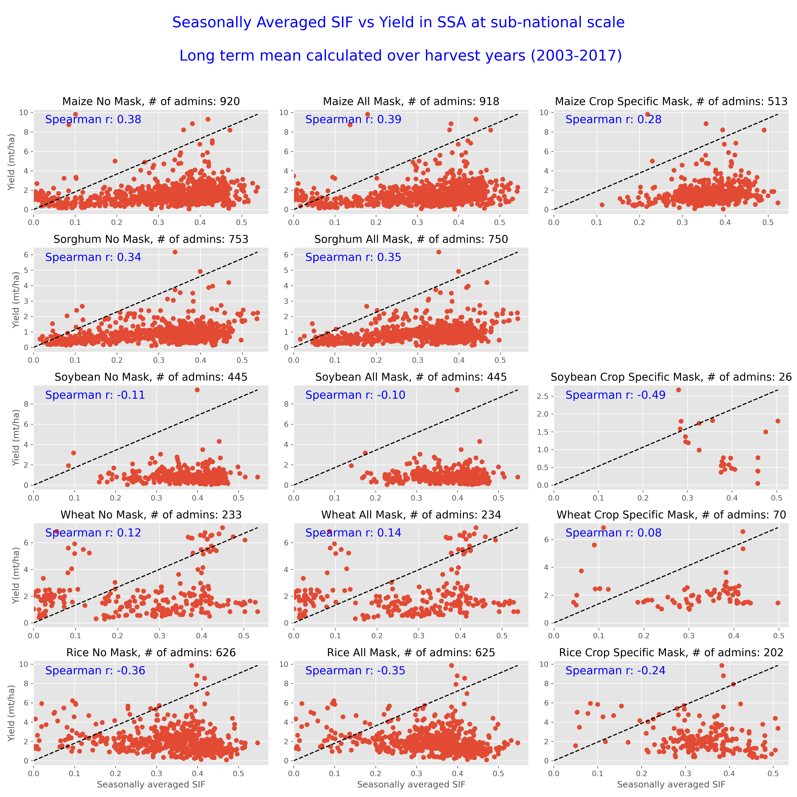
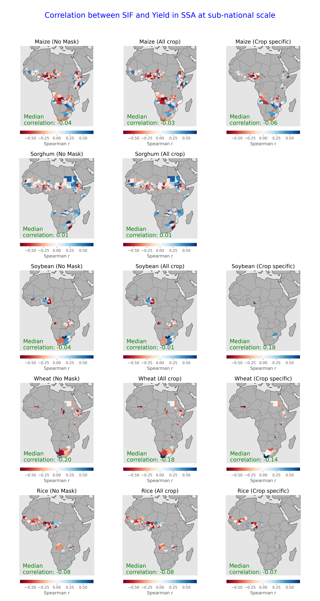

## Research questions
- How well can SIF explain the variability in agricultural productivity in sub‑Saharan Africa (SSA)?
- How does the relationship between SIF and agricultural productivity vary by crop type?

## Methods
See how gridded monthly SIF data was used to calculate spatially aggregated seasonal SIF [here](https://github.com/Shrad-Shukla1/crop_yield_forecasting/blob/main/docs/compile_yield_sif_ts_summary.md)
## Results
The results below show how seasonal SIF compares with the spatial variability in long‑term mean yield and interannual variability in reported yield in SSA.
The analysis focuses on five major crops that fall into either C3 (Maize, Sorghum, Soybean) or C4 (Wheat, Rice) categories.
The choice of crops also depends on the availability of reported yield for those crops as well as the availability of crop‑specific masks.
The analysis further tests the impact of crop masking, considering three cases:
- **No mask** – when no crop mask is applied to the SIF data within a given administrative unit.
- **All‑crop mask** – when a cropland layer (which includes regions that grow all major crops) is applied to the SIF data.
- **Crop‑specific mask** – when a crop‑specific cropland layer is applied to the SIF data.

**Key findings**
1. In general, the relationship between SIF and reported yields is stronger for C3 crops than for C4 crops.
2. This relationship does not appear to be sensitive to the choice of crop mask.

> **Figure 1** – Scatter plot of the long‑term mean of seasonal SIF versus the long‑term mean of reported crop yield across different admin units in SSA.
> For each admin unit, the SIF data was processed with (i) no mask (first column), (ii) all‑crop mask (middle column), and (iii) crop‑specific mask (third column).
> The last two columns consider only SIF grids where the fractional crop area is at least ~10 %.
> 

> **Figure 2** – Spatial map showing the correlation between seasonal SIF and sub‑national scale reported crop yield for each admin unit with at least 10 years of reported yield (2003–2017).
> The overall number of admin units declines as SIF data is screened out based on the all‑crop or crop‑specific masks.
> Some admin units have reported yield for a crop but none of the pixels within the unit report more than 10 % fractional area cropped.
> 
# References and summary
1. He, L., Magney, T., Dutta, D., Yin, Y., Köhler, P., Grossmann, K., et al. (2020). *From the ground to space: Using solar‑induced chlorophyll fluorescence to estimate crop productivity*. Geophysical Research Letters, 47, e2020GL087474. https://doi.org/10.1029/2020GL087474

   - This study highlights the variation in the SIF–NPP/crop productivity relationship for C3 vs. C4 crops.
     Typical C3 crops include soybeans, wheat, barley, oats, and rice; typical C4 crops include corn, sugarcane, and sorghum.
     The study finds that the relationship is more linear with a steeper slope for C4 crops.
- The study also uses seasonally integrated SIF to predict crop yield. 
   - Based on these results, I plan to:
     - Compute the correlation between seasonally aggregated SIF and crop yield for Maize, Sorghum, Wheat, and Millet across SSA.
     - Compute the correlation between seasonal maximum SIF and crop yield for the same crops.
     - Perform the above analyses using Lu et al., IFPRI, and crop‑specific (BEST) masks.
     - The analysis will reveal how well remotely sensed SIF correlates with crop yield for different C3 and C4 crops, and how sensitive that correlation is to:
       1. The method used to compute growing‑season SIF (integrated vs. maximum).
       2. The masking strategy applied to SIF.
   - The script I’m using for this is here: `/home/chc-source/shrad/Scripts/Funded_projects/2026/crop_yield_forecasting/code/python/compile_yield_sif_ts.py`
08/11/2026
Today I will work on expanding the SIF–crop‑yield correlation from only South Africa to all SSA countries for which 2003‑2018 data are available.
I will implement the code so that it is easy to experiment with at least two different ways to calculate growing‑season SIF: (a) seasonally integrated SIF and (b) seasonal maximum SIF.
