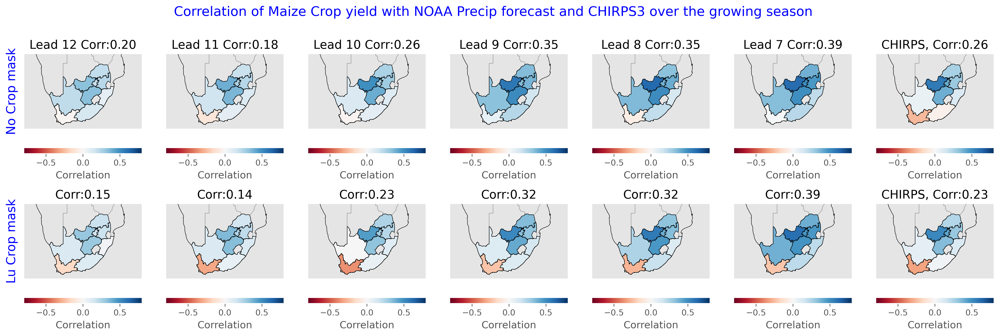
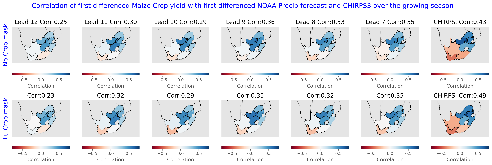

# NOAA Climate Forecast vs. Crop Yield Analysis

## Overview
The NOAA Climate Forecast (CF) vs. Crop Yield study quantifies the relationship between NOAA’s 1–12 month precipitation forecasts and observed maize yield across Southern Africa. Using crop‑mask‑weighted precipitation totals, Spearman rank correlations are computed for multiple lead times, and the results are visualised in a 28‑panel correlation‑map grid.

## Results

*Key findings*
1. Correlation between NOAA precipitation forecasts accumulated over the growing season and crop yield increases as the forecasts is generated closer to the growing season.
2. The correlation between NOAA precipitation forecasts and crop yield is not very sensitive to crop masking and detrending (first differencing) in this case.
3. The correlation between CHIRPS and yield increases substantially after applying first differencing.
4. Without applying first differencing the correlation of noaa precipitation forecasts (generated closer to the growing season) with yield is higher than their correlation with CHIRPS. Perhaps noaa precipitation forecasts have similar trend as the crop yield?

> The following figure shows the correlation between absolute values of NOAA precip forecasts and crop yield, CHIRPS and crop yield over the growing seasons of roughly 1991-2022. The main growing season for Maize crop in South Africa typically spans over October-April. For this analysis, the forecasts generated 12 to 7 months before the harvest month (April) were used to calculate growing seasonal total precipitation forecasts. For example, for the growing season of 1991/92 which spans from Octover 1991 to April 1992. The earliest forecast for the growing season was generated in May (lead-12 before harvest month) and the latest forecasts were generated in October 1991 (lead-7 months before harvest). 

**No crop mask** The map in the top panel uses NOAA precipitation forecasts and CHIRPS that were aggregated over given admin unit without applying any crop mask

**Lu crop mask** The map in the top panel uses NOAA precipitation forecasts and CHIRPS that were aggregated over given admin unit after applying Lu crop mask.



>  The following figure is the same as above. The only main difference being that first difference was applied on the yield time-series as well as NOAA precipitation forecasts and CHIRPS before calculating the correlation values. First difference was applied to detrend all of the time-series before calculating the correlation. 

- After applying first difference the correlation of CHIRPS with crop yield is substantially higher than the correlation with the NOAA precipitation forecasts. 



| File | Description |
|------|-------------|
| `noaa_cfs_vs_yield_1991_2023_Maize_crop_lu_crop_mask.csv` | This csv contains time-series of spatially aggregated NOAA precipitation forecasts and CHIRPS along with crop yield. This contains time-series of NOAA precipitation forecasts and CHIRPS with and without crop‑mask weighting.


## Methods
### Data Sources
- **NOAA Climate Forecast (CF)** – 1–12 month precipitation forecasts, regridded to 1 × 1 deg.  Dataset located at `DATA/Crop_yield_forecasting/noaa_experimental_climate_forecasts/CHIRPS3_Prate_Monthly_Forecasts_1981_2023_leads1-12_1x1deg.nc`.
- **CHIRPS** – Observed precipitation, regridded to 1 × 1 deg.  Dataset located at `DATA/Crop_yield_forecasting/noaa_experimental_climate_forecasts/chirpsv3_regridded_to_NMME_1981-2024_conservative_normed_converted_to_mm_per_day.nc`.
- **Crop Data** – Maize production statistics from the hvstat database (`hvstat_africa_data_v1.2.csv` and `hvstat_africa_boundary_v1.2.gpkg`).
- **Administrative Boundaries** – Shapefile for South Africa (`hvstat_africa_boundary_v1.2.gpkg`).

### Pre‑processing
1. **Regridding crop mask** Existing crop masks were first regridded to the grids of NOAA precipitation forecasts using an area coservation method.  
2. **Subsetting** – The crop dataset is filtered by crop type (Maize), country (South Africa), quality flag (`qc_flag == 0`), and harvest year range (1991–2023). Unique spatial units (fnid) are identified.
3. **Masking** – A crop‑mask fraction (stored in `crop_mask_fraction_on_noaa_fcst_grid_conservative.nc`) is subsetted to each fnid and applied to both NOAA CF and CHIRPS data. Only grid cells with `crop_fraction >= 0.1` are retained.

### Aggregation & Masking
For each fnid and each lead time (12 → 6 months):
- A growing‑season window is defined from the first day of planting month to the last day of harvest month.
- NOAA CF precipitation forecasts are summed over this window, then masked by the crop fraction.
- The masked totals (`noaa_cf_mm`, `noaa_cf_masked_mm`) and the CHIRPS totals (`chirps_mm`, `chirps_masked_mm`) are stored for correlation analysis.

### Correlation Analysis
Spearman rank correlations are computed between crop yield and the following series:
- `noaa_cf_mm` (absolute NOAA CF)
- `noaa_cf_masked_mm` (NOAA CF after crop‑mask filtering)
- `chirps_mm` (absolute CHIRPS)
- `chirps_masked_mm` (CHIRPS after crop‑mask filtering)

Both absolute and first‑difference series are analysed. The results are aggregated by fnid and lead time into two CSV files.

### Visualization
A 28‑panel map grid is created for each of the two correlation sets:
- Panels 0‑11: NOAA CF correlations (masked and unmasked) for leads 12 → 6 months.
- Panels 12‑23: CHIRPS correlations (masked and unmasked) for leads 12 → 6 months.
- Panel 24: Median correlation for all masked NOAA CF leads.
- Panel 25: Median correlation for all masked CHIRPS leads.

---

**How to reproduce the results**

```bash
# Navigate to the project root
cd /home/chc-source/shrad/Scripts/Funded_projects/2026/crop_yield_forecasting

# Install dependencies (if not already present)
pip install -r requirements.txt

# Run the notebook (requires nbconvert)
jupyter nbconvert --to notebook --execute code/noaa_cf_based_crop_yield_forecast/compile_noaa_cf_vs_yield.ipynb

# The output CSVs and PNGs will be in results/noaa_cf_vs_yield/
```

**Notes**
- The script relies on the presence of the crop‑mask NetCDF (`crop_mask_fraction_on_noaa_fcst_grid_conservative.nc`). Ensure it is in the expected location.
- The `noaa_cf_vs_yield` directory will be created automatically if it does not exist.
- The notebook uses the `salem` library for spatial subsetting; the `salem` version used in the environment is `v2.1.0`.

---

*This documentation was generated automatically based on the notebook code and existing outputs.*

